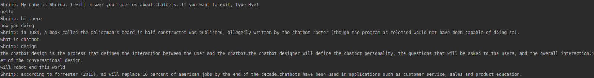

# Shrimp
A simple chatbot build with Python & NLTK.

## Installation

Installation is simplest:

1. Clone the repository
2. Install dependencies with `pip install -r requirements.txt`
3. You are good to go!    

#### Installation notes

Shrimp depends on:
 1. `NLTK`
 2. `SKLearn`

## Usage

Check out A simple usage example for a short intro. A sample usage is:

```
python bot.py
```

output is:



## Contributing

Feel free to submit pull requests to me.

## Authors

* **Muhammad Haseeb** - *Initial work* - [Muhammad Haseeb](https://github.com/iam-mhaseeb)

## Licensing

